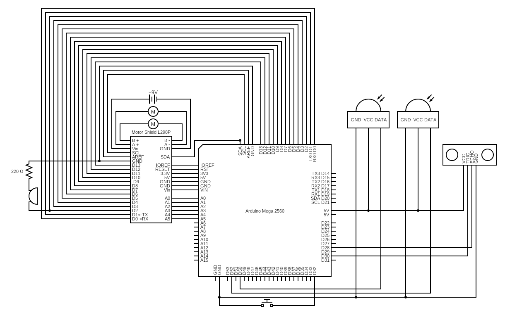
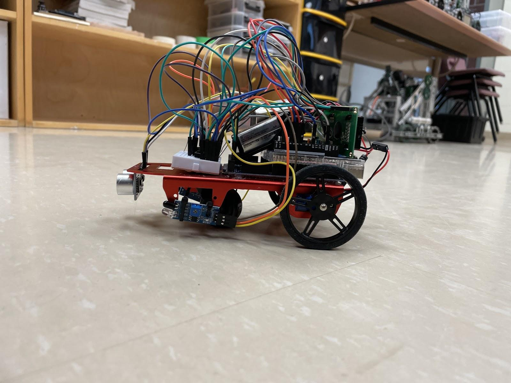
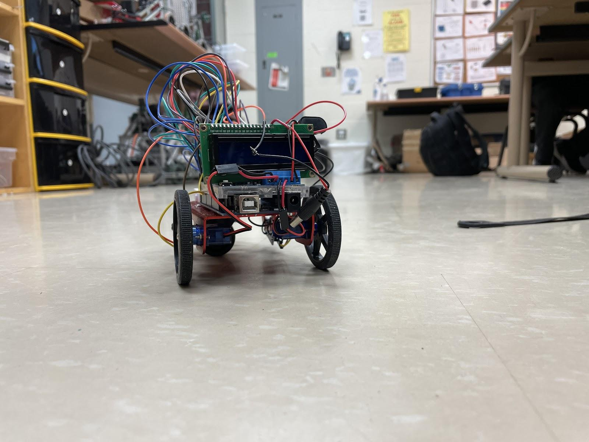

<h2>**Human Tracking Robot**</h2>

**Peterson Guo**

June 5, 2022

<h2>Introduction</h2>

In this project, an ultrasonic distance sensor and two ir sensors work with a robot that has two motors to follow a human. It also contains an LCD to display sensor readings, a button to cycle between the sensor data, and a potentiometer to adjust the contrast of the LCD. The IR sensors emit infrared radiation which will reflect off objects. The receiver will then be able to receive this reflected radiation and determine whether an object is in front of the robot. Two IR sensors are used on the left and right side of the robot to determine which direction the robot should turn. Ultrasonic sensors are also used in this project to gauge the distance between the human and the robot. IR sensors have a very limited range since infrared radiation has a short wavelength. Thus, the ultrasonic sensor can be used to maintain the perfect distance for the IR sensors to be within working range and for the robot to be out of the human’s walking space. This robot also takes advantage of two motors and a motor shield. The motor shield controls the motors of the robot and the motors will allow the robot to turn, move forward, and move backward.

<h2>Component List</h2>

<table>
  <tr>
   <td>Component #
   </td>
   <td>Component
   </td>
   <td>Value
   </td>
   <td>Quantity
   </td>
  </tr>
  <tr>
   <td>1
   </td>
   <td>Arduino Motor Shield
   </td>
   <td>
   </td>
   <td>1
   </td>
  </tr>
  <tr>
   <td>2
   </td>
   <td>Arduino Uno
   </td>
   <td>
   </td>
   <td>1
   </td>
  </tr>
  <tr>
   <td>3
   </td>
   <td>Resistor
   </td>
   <td>1kΩ
   </td>
   <td>1
   </td>
  </tr>
  <tr>
   <td>4
   </td>
   <td>Resistor
   </td>
   <td>220Ω
   </td>
   <td>1
   </td>
  </tr>
  <tr>
   <td>5
   </td>
   <td>Ultrasonic Sensor
   </td>
   <td>
   </td>
   <td>1
   </td>
  </tr>
  <tr>
   <td>6
   </td>
   <td>Buzzer
   </td>
   <td>
   </td>
   <td>1
   </td>
  </tr>
  <tr>
   <td>7
   </td>
   <td>DC Motors
   </td>
   <td>
   </td>
   <td>2
   </td>
  </tr>
  <tr>
   <td>8
   </td>
   <td>Mini Breadboard
   </td>
   <td>
   </td>
   <td>1
   </td>
  </tr>
  <tr>
   <td>9
   </td>
   <td>Jumper wires
   </td>
   <td>
   </td>
   <td>40
   </td>
  </tr>
  <tr>
   <td>10
   </td>
   <td>Chassis
   </td>
   <td>
   </td>
   <td>1
   </td>
  </tr>
  <tr>
   <td>11
   </td>
   <td>Wheels
   </td>
   <td>
   </td>
   <td>2
   </td>
  </tr>
  <tr>
   <td>12
   </td>
   <td>IR Sensors
   </td>
   <td>
   </td>
   <td>2
   </td>
  </tr>
  <tr>
   <td>13
   </td>
   <td>Battery
   </td>
   <td>9V
   </td>
   <td>2
   </td>
  </tr>
  <tr>
   <td>14
   </td>
   <td>LCD
   </td>
   <td>
   </td>
   <td>1
   </td>
  </tr>
  <tr>
   <td>15
   </td>
   <td>Potentiometer
   </td>
   <td>
   </td>
   <td>1
   </td>
  </tr>
  <tr>
   <td>16
   </td>
   <td>Button
   </td>
   <td>
   </td>
   <td>1
   </td>
  </tr>
</table>

<h2>Circuit Diagram</h2>

<h2>Photo of Finished Project</h2>

